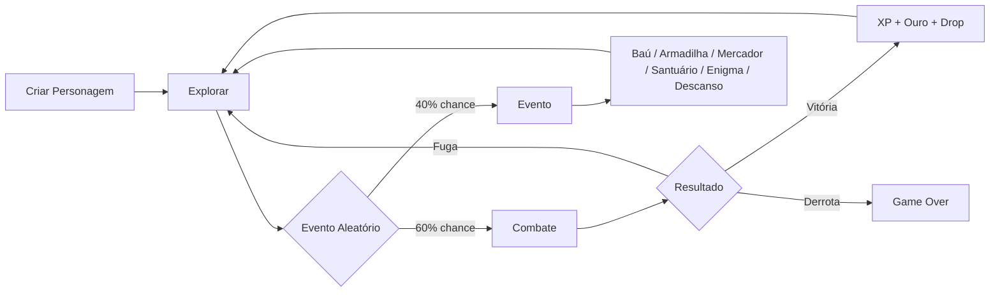

# ⚔️ RPG POO

**[Versão em inglês](README-ENGLISH.md)**

> Um RPG de combate por turnos feito em Python com Tkinter — criado para praticar **Programação Orientada a Objetos** de um jeito divertido.

---

## 📖 Sobre o Projeto

O **RPG POO** é um jogo de RPG desktop com interface gráfica onde você escolhe uma classe, explora dungeons, enfrenta inimigos, sobe de nível e coleta itens. Cada mecânica do jogo foi pensada para exercitar um conceito diferente de POO: herança, polimorfismo, encapsulamento, classes abstratas e propriedades.

É simples, bagunçado nos cantos, e completamente funcional — exatamente como deve ser um projeto de aprendizado.

---

## 🧠 Conceitos de POO Praticados

| Conceito | Onde aparece no código |
|---|---|
| **Classe Abstrata** | `Personagem` (ABC) com método `atacar()` abstrato |
| **Herança** | `Jogador` e `Inimigo` herdam de `Personagem`; inimigos específicos herdam de `Inimigo` |
| **Polimorfismo** | Cada inimigo tem seu próprio `atacar()` — `Slime` se regenera, `LoboMutante` ataca duas vezes |
| **Encapsulamento** | Stats do jogador protegidos; bônus de equipamentos calculados via `@property` |
| **Composição** | `Jogador` contém instâncias de `Item`, `Habilidade` e equipamentos |
| **Properties** | `hp_max`, `mana_max`, `atk_total`, `dfn_total` com bônus dinâmicos de equipamentos |

---

## 🎮 Funcionalidades

- **3 classes jogáveis** — Guerreiro, Mago e Ladino, cada uma com atributos e habilidades únicas
- **Sistema de combate por turnos** com ataque básico, habilidades e uso de itens
- **5 tipos de inimigos** + 2 chefões com comportamentos distintos
- **Sistema de elementos** com fraquezas e resistências (fogo × gelo)
- **Eventos aleatórios** ao explorar: baú, armadilha, descanso, mercador, santuário e enigma
- **Inventário completo** com poções, bombas, elixires e equipamentos empilháveis
- **Sistema de equipamentos** em 3 slots — arma, armadura e acessório
- **Level up** com escalonamento de atributos por classe
- **Interface gráfica** com barras de HP, MP e XP em tempo real

---

## 🏹 Classes Disponíveis

| Classe | HP | ATK | DFN | Mana | Destaque |
|---|---|---|---|---|---|
| ⚔️ Guerreiro | 50 | 12 | 4 | 15 | Maior HP e defesa |
| 🧙 Mago | 35 | 4 | 1 | 50 | Magias poderosas de fogo e gelo |
| 🗡️ Ladino | 40 | 10 | 2 | 20 | Crítico (35%) e 85% de chance de fuga |

---

## 👾 Inimigos

| Inimigo | Elemento | Comportamento Especial |
|---|---|---|
| Goblin | Neutro | — |
| Slime | Neutro | Regenera HP após atacar |
| Orc | Neutro | — |
| Esqueleto | Neutro | Alta defesa |
| Lobo Mutante | Neutro | 25% de chance de atacar duas vezes |
| **Rei Orc (Chefe)** | 🔥 Fogo | Golpe Esmagador garantido |
| **Dragão (Chefe)** | 🔥 Fogo | Stats elevados |

Chefões aparecem a cada **5 batalhas vencidas**.

---

## 🗺️ Fluxo de Jogo



---

## ⚙️ Requisitos

- Python **3.8+**
- `tkinter` — já incluído na instalação padrão do Python

> ⚠️ No Linux, pode ser necessário instalar separadamente:
> ```bash
> sudo apt-get install python3-tk
> ```

---

## 🚀 Como Rodar

```bash
# Clone ou baixe o arquivo
git clone https://github.com/seu-usuario/rpg-poo.git
cd rpg-poo

# Execute diretamente
python rpg_poo.py
```

Nenhuma dependência externa necessária.

---

## 📝 Notas de Desenvolvimento

Este projeto **não tem como objetivo ser um jogo polido** — ele foi feito para fixar conceitos de POO enquanto construía algo que desse vontade de rodar e testar.

---

*Feito com Python, Tkinter e muita vontade de não estudar POO pelo livro.* 🐍
